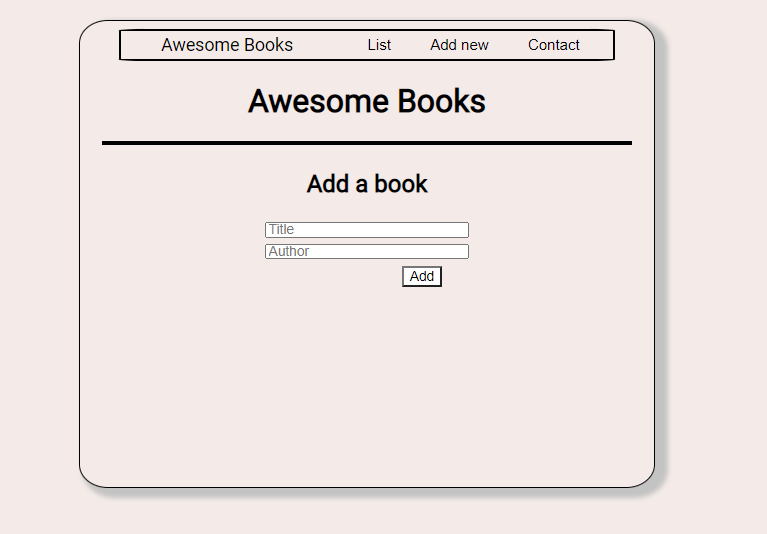

# Awesome-Books

This project was created with the objetive of learning how to use classes and it's respective methods.

## Built With

- HTML & JavaScript

## Live Demo

[Live Demo Link](https://marcosmerida.github.io/Awesome-Books/)

## Instalation

To get a local copy up and running follow these simple example steps.
- Open terminal
- Clone this project by command git clone https://github.com/marcosmerida/Awesome-Books/tree/Testing
- cd capstone-project folder
- Open index.html in browser

### Prerequisites

- IDE to edit and run the code (We've used Visual Studio Code 🔥).

### Usage

- For anyone who wants to practice HTML5 and JavaScript.
- How to storage data locally in the browser and Array practices.
- Classes and construct practices.

## Authors

👤 **Juan Marcos Mérida**

- GitHub: [@githubhandle](https://github.com/marcosmerida)
- LinkedIn: [LinkedIn](https://linkedin.com/in/marcos-merida-219437206/)

👤 **ThankGod Richard**

- GitHub: [@githubhandle](https://github.com/thankgodr)
- LinkedIn: [LinkedIn](http://www.linkedin.com/in/thankgodr)

## Show your support

Give a ⭐️ if you like this project!
